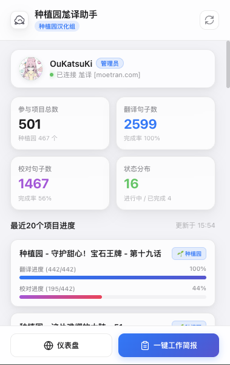
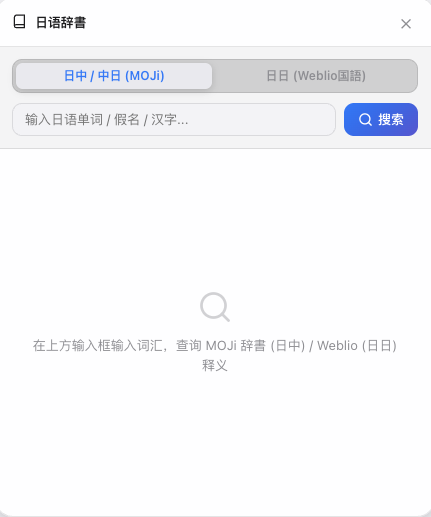
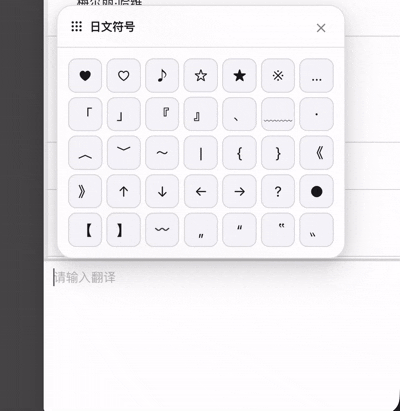
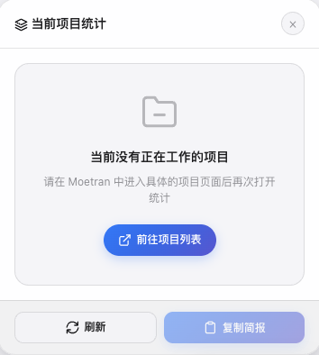
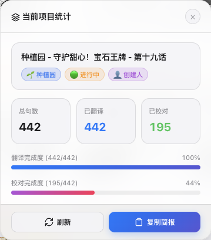
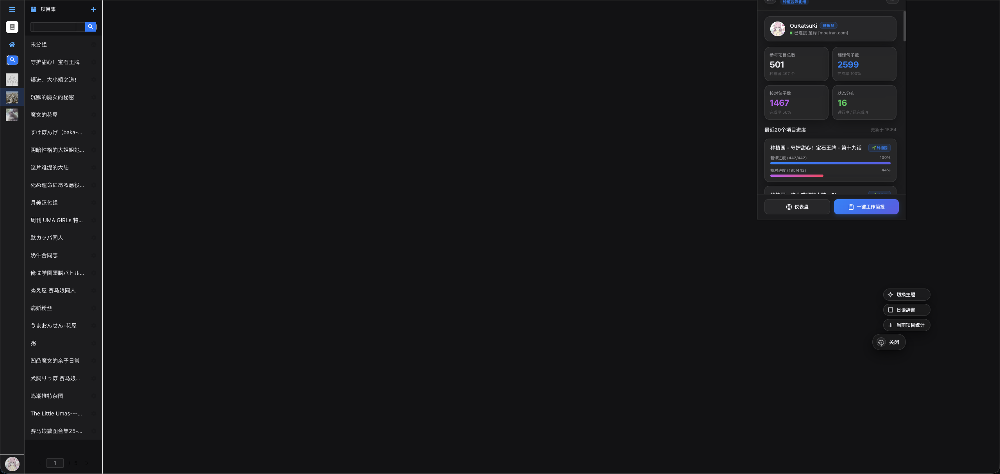
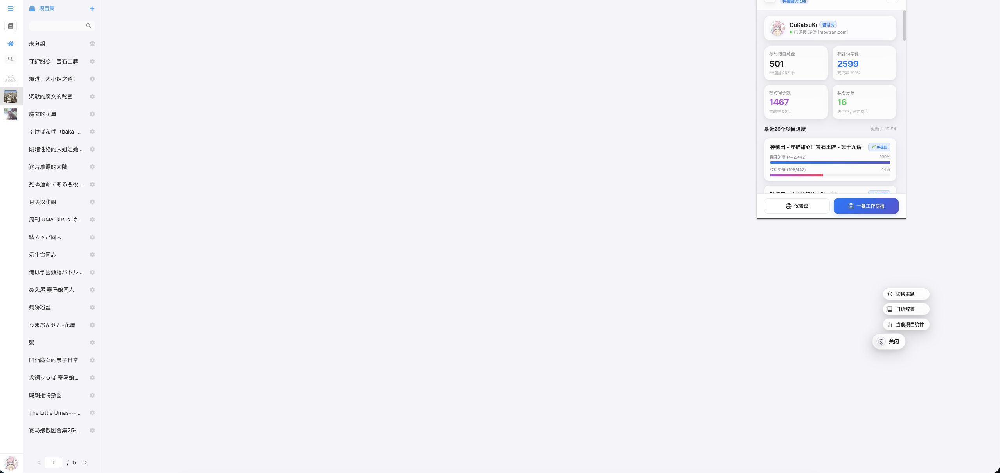

#  种植园尨译助手 (Zhongzhiyuan Moetran Helper)

[](https://developer.chrome.com/docs/extensions/mv3/intro/)
[](LICENSE)
[](https://www.google.com/chrome/)

**种植园尨译助手** 是一款专为 [Moetran (尨译)](https://moetran.com) 翻译平台成员（尤其是种植园汉化组成员）打造的自动化浏览器扩展（Chrome Manifest V3）。

它能够自动感知登录状态、精准抓取翻译与校对进度，并集成了 **内置日语辞書（MOJi + Weblio）**、**防闪烁主题切换 (Anti-FOUC)**、**灵动岛悬浮挂件** 以及 **一键工作简报生成** 功能。

---

## ✦ 核心特性 (Features)

- ❖ **全维工作数据统计**
  - **全量项目统计**：自动迭代 API 多页数据，精确统计您历史参与的所有项目总数及种植园项目数。
  - **最近 20 项目精细监控**：句数统计（翻译 / 校对句数）、完成率及状态分布基于最近 20 个项目展示。
  - **当前项目实时感知**：在网页具体项目区，悬浮挂件自动读取当前项目的实时进度，并支持生成专属项目简报。
  - **双 100% 完成规则**：仅在翻译进度与校对进度**同时达到 100%** 时判定为已完成 (Finished)。

- ❖ **内置日语辞書助手 (MOJi + Weblio)**
  - **MOJi 辞書 (日中/中日)**：自动检索假名、发音、声调、详细中文释义及精选双语例句。
  - **Weblio 国語 (日日)**：原生解析 Weblio 词条内容，提供权威日日释义与直接跳转入口。
  - **可拖拽独立窗口**：支持在网页内任意拖拽词典窗口，自动记忆上次停留位置 (`mt-jdict-pos`)。

- ❖ **防闪烁主题与极简 UI**
  - **三档主题控制**：支持 **跟随系统 (System)**、**强制深色 (Dark)** 和 **强制浅色 (Light)**。
  - **Anti-FOUC 预加载**：在 `document_start` 阶段给 `<html>` 设置 `data-mt-theme` 属性，彻底消除刷屏闪烁。
  - **灵动岛悬浮挂件**：嵌入 `moetran.com` 网页，具备 Pointer Events 拖拽吸附、边缘裁剪防溢出与平滑二级选单。

- ❖ **高效汇报与网络优化**
  - **一键工作简报**：自动生成符合团队规范的 Markdown 简报（全量统计/当前项目统计）并写入剪贴板。
  - **头像防盗链修正**：基于 MV3 `declarativeNetRequest` 自动修饰 Header，解决 `m-t.pics` 图片 403 跨域问题。

---

## ✦ 界面展示 (Screenshots)

<details open>
<summary><b>▸ 扩展 Popup 弹窗与灵动岛悬浮胶囊</b></summary>
<br>

| Popup 扩展弹窗仪表盘 | 灵动岛悬浮胶囊挂件 |
| :---: | :---: |
|  |  |
| *全量统计、最近 20 个项目列表与分步诊断* | *灵动岛胶囊交互与平滑二级选单* |

</details>

<details open>
<summary><b>▸ 内置日语辞書 (MOJi + Weblio)</b></summary>
<br>

| 日语辞書窗口 (MOJi 日中 / Weblio 日日) |
| :---: |
|  |
| *假名、发音、例句与权威日日释义* |

</details>

<details open>
<summary><b>▸ 日文符号自动键入</b></summary>
<br>

| 日语输入时 (键入 Japanese Punctuation) |
| :---: |
|  |
| *键入 /键入・ 自动转换为「」「」、；/；、：/：、* |

</details>

<details open>
<summary><b>▸ 当前项目实时统计 Modal (未打开项目 / 已打开项目)</b></summary>
<br>

| 未打开项目时 (默认提示) | 已打开项目时 (句数/进度/简报) |
| :---: | :---: |
|  |  |
| *智能提示前往项目列表* | *实时计算句数、完成度与专属简报* |

</details>

<details>
<summary><b>▸ 主题模式对比 (深色 / 浅色)</b></summary>
<br>

| 强制深色模式 (Dark) | 强制浅色模式 (Light) |
| :---: | :---: |
|  |  |

</details>

---

## ✦ 快速开始 (Quick Start)

1. **下载源码**：
   ```bash
   git clone https://github.com/your-username/Moeflow-extend.git
   ```
2. **加载扩展程序**：
   - 打开 Chrome / Edge 浏览器，访问 `chrome://extensions/`
   - 开启右上角的 **开发者模式 (Developer mode)**
   - 点击左上角 **加载已解压的扩展程序 (Load unpacked)**，选择 `Moeflow-extend` 文件夹
3. **开始使用**：
   - 在浏览器中打开并登录 [moetran.com](https://moetran.com)，点击扩展图标或网页右下角悬浮挂件即可！

---

## ✦ 目录结构

```text
Moeflow-extend/
├── manifest.json             # Chrome Extension Manifest V3 配置文件
├── background.js             # Service Worker 后台服务 (统计刷新、API 中转与字典请求)
├── content.js                # 网页 Content Script (悬浮胶囊挂件、词典弹窗、单项目统计与 Token 捕获)
├── content.css               # 悬浮挂件、词典窗口与 Modal 样式 (iOS Dynamic Island 风格)
├── popup.html                # 扩展 Popup 视图 HTML
├── popup.js                  # 扩展 Popup 逻辑 (数据渲染与诊断测试)
├── popup.css                 # 扩展 Popup 样式 (Apple SF 风格 Design Tokens)
├── theme-preloader.js        # 网页防闪烁主题预加载脚本 (document_start)
├── popup-theme-preloader.js  # Popup 防闪烁主题预加载脚本
├── moetran-theme.css         # Moetran 网页端定制主题样式表
├── rules.json                # declarativeNetRequest 头像 Referer 修改规则
├── utils/
│   └── moetranApi.js         # REST API 服务模块 (Token 提取、多页分页与统计计算引擎)
├── img/
│   ├── cotton.png            # 插件主图标 (棉花)
│   ├── icon.png              # 默认浅色图标
│   └── icon-white.png        # 默认深色图标
├── tests/
│   └── theme.spec.mjs        # Playwright E2E 自动化测试
├── AGENTS.md                 # AI Agent 开发指南与架构规范
└── README.md                 # 项目说明文档
```

---

## ✦ 技术细节与 API (Technical Specifications)

- **Manifest**: Chrome Extension Manifest V3 (`"type": "module"`)
- **API 交互接口**:
  - `GET /v1/user/info`: 用户信息与团队身份
  - `GET /v1/user/projects`: 分页获取参与项目列表 (`X-PAGINATION-COUNT`)
  - `GET /v1/teams/{teamId}/members`: 种植园汉化组成员角色解析
  - `MOJi 辞書 API`: `https://api.mojidict.com/app/mojidict/api/v2/search/all` & `v1/word/detailInfo`
  - `Weblio API`: `https://www.weblio.jp/content/` (Service Worker 后台代理请求并清洗)
- **网络规则 (declarativeNetRequest)**:
  - 通过 `rules.json` 给 `*m-t.pics*` 与 `*moetran.com/avatars*` 补充 Referer 与 Origin 请求头，消除 403 跨域阻断。
- **自动化测试**:
  - 执行 `npx playwright test tests/theme.spec.mjs` 运行 E2E 主题与挂件测试。

---

## ✦ 开源许可证

本项目采用 [MIT License](LICENSE) 许可证。
